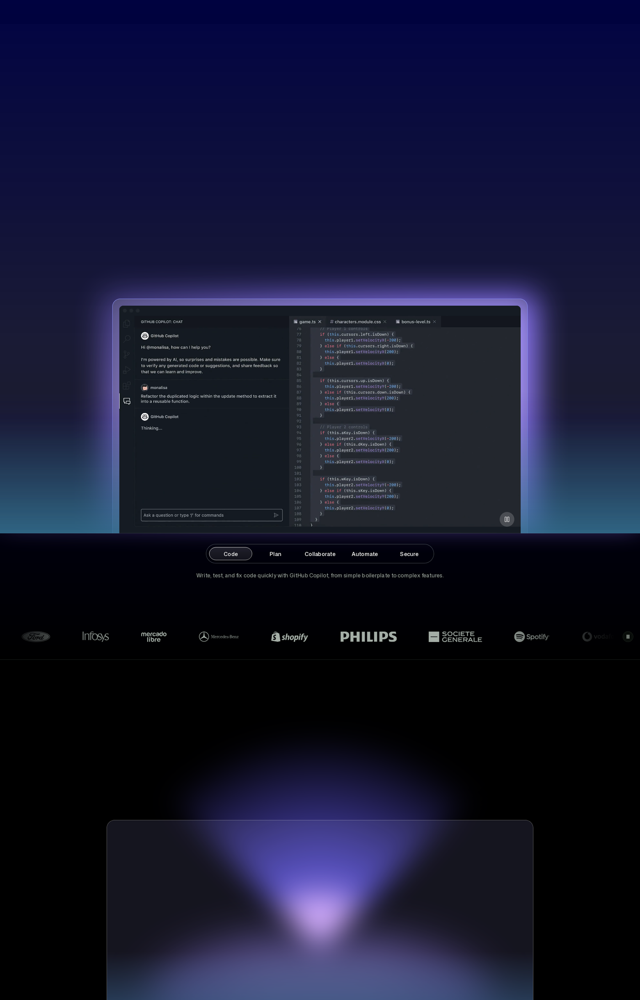
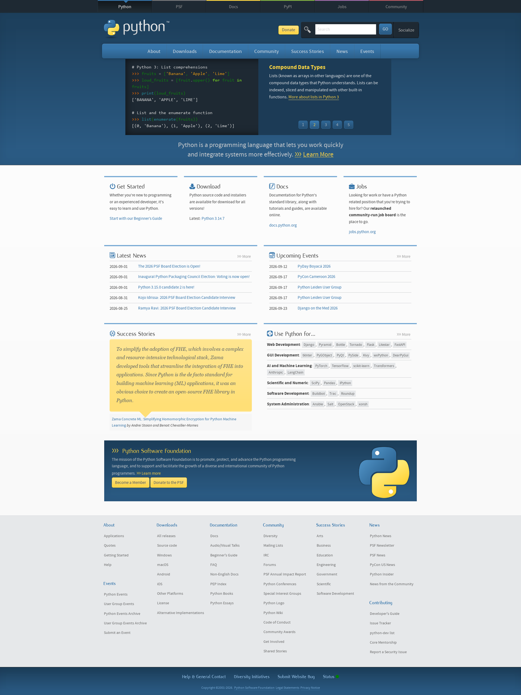
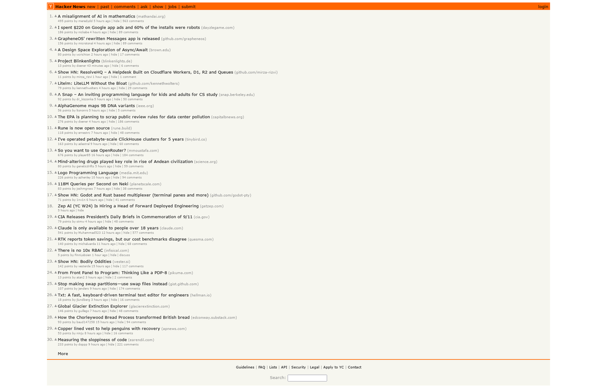

# 🕷️ Web Scraper Toolkit

## Unified AI browser and scraper

The toolkit now exposes two high-level workflows from one package:

```python
from web_scraper import scrape_web, browser_task

scrape_web("https://example.com")
browser_task("https://example.com", "Find the contact page and open it")
```

CLI:

```bash
python toolkit.py scrape https://example.com
python toolkit.py browser https://example.com "Open the contact page"
```

Browser control uses any OpenAI-compatible chat-completions provider. Configure
`BROWSER_LLM_API_KEY`, `BROWSER_LLM_BASE_URL`, and `BROWSER_LLM_MODEL` in the
environment. TypeSafe is not required.


> A production-grade Python scraping arsenal — stealth browsing, WAF detection, image grabbing, distributed crawling, and more. Built to handle the modern anti-bot web.

**One command, full page:** WAF detection picks the right stealth backend automatically, downloads the page, takes a full-page screenshot, extracts clean article text, and exports to 5 formats.

```bash
python master_pipeline.py https://example.com
```

## 📸 Real output

All screenshots below were captured by this toolkit — full-page stealth renders through Camoufox, no manual touch-ups.

### GitHub — full-page scrape

The complete github.com landing page (originally 1920×11809 px) captured in a single run, with 22 images (2.6 MB) downloaded alongside it.



### Python.org



### Hacker News

A Cloudflare-aware scrape of a minimal, JS-light site:



---

## ✨ Highlights

- 🛡️ **WAF-aware backend selection** — fingerprints Cloudflare/Akamai/Imperva/Sucuri/AWS WAF/F5 and picks the right tool: Camoufox for heavy protection, Playwright for medium, raw `httpx` for none
- 🦊 **Camoufox stealth Firefox** — TLS fingerprint, canvas/WebGL/audio noise patched at browser level; not detectable like stock headless Chrome
- 🖼️ **Image grabber** — screenshots any page and bulk-downloads its images (``, `srcset`, `og:image`, CSS backgrounds) with proper Referer headers
- 🧬 **Deterministic fingerprint noise** — canvas/WebGL/audio spoofing with consistent per-session seeds, so your fingerprint is realistic but stable
- 🔁 **Resilience built in** — circuit breakers, exponential backoff with jitter, token-bucket rate limiting, request deduplication
- 🌐 **Proxy rotation** — health-checked pool with round-robin/random/best/sticky strategies; integrates with requests, httpx, Selenium, and Playwright
- 🧩 **CAPTCHA solving — free-first** — Scrapling's keyless solver clears Cloudflare interstitials + clicks Turnstile in-session; reCAPTCHA/hCaptcha escalate to 2captcha/anti-captcha only when a paid key is set — *see [caveats](#captcha-solving--free-first)*
- 🔍 **Traffic sniffing** — record pages to HAR via Playwright CDP or mitmproxy; extract hidden API endpoints, export to CSV/SQLite
- ⚡ **Distributed crawling** — Redis-backed master/worker architecture with deduplication, priority queues, and stats
- 📊 **5 export formats** — JSON, CSV, Markdown, dark-mode HTML report, SQLite
- 🎭 **Scrapling fusion** — curl_cffi TLS-impersonating HTTP, DynamicFetcher, and StealthyFetcher as first-class pipeline backends (`--scrapling`), plus an automatic stealth recovery pass when any backend fails
- 📍 **Google Maps lead-gen** — `maps_scraper.py`: businesses + phones + emails + socials via the gosom API (Docker), with stealth-enriched websites (urllib → httpx → Camoufox escalation)
- 🧪 **Universal file → Markdown** — `markitdown_convert.py`: PDF/DOCX/XLSX/PPTX/images/audio/HTML all become clean Markdown
- 🔒 **SSRF-guarded enrichment** — every user- or listing-supplied URL is validated (no private/link-local/metadata ranges) before any fetcher touches it
- 📋 **Form engine** — `form_fill.py`: extract a JSON schema of any page's forms, auto-fill text/select/radio/checkbox (case-insensitive label matching), submit — verified end-to-end against httpbin
- 🤖 **Agent-native** — `agent_tools.py` façade (13 JSON-in/JSON-out tools), **MCP server** (`mcp_server.py`), `SKILL.md` + `llms.txt`: plug the whole arsenal into Claude/agents directly
- 🍪 **Authenticated scraping** — `cookies.py` reuses your local browser's cookies (domain-scoped, least privilege) for logged-in pages — no password scripts, no 2FA prompts

## What's in the box

| Category | Tools | Path |
|----------|-------|------|
| **Core scraper** | Camoufox + Playwright (download + screenshot + extract) | `scraper.py` |
| **Image grabber** | Page screenshot + bulk image download | `grab_images.py` |
| **Master pipeline** | WAF-detect → auto-backend → scrape → extract → export | `master_pipeline.py` |
| **Scrapling backend** | curl_cffi TLS spoof / DynamicFetcher / StealthyFetcher (+ auto recovery) | `scrapling_backend.py`, `master_pipeline.py --scrapling` |
| **Google Maps leads** | Business listings + phones/emails/socials (gosom API + stealth enrichment) | `maps_scraper.py` (+ `maps.compose.yml`) |
| **SaaS site extractor** | Homepage + marketing subpages → structured content | `examples/content_extract/saas_extract.py` |
| **File → Markdown** | PDF/DOCX/XLSX/PPTX/images/audio/HTML → clean Markdown | `examples/content_extract/markitdown_convert.py` |
| **SSRF guards** | Private/metadata-IP rejection for untrusted URLs | `security_utils.py` |
| **MedEx pharma scraper** | Domain-specialist merge from ~/Downloads/scraper: 25k-brand Bangladesh drug DB (indications/dosage/৳prices), async HTTP/2 + backoff + stealth escalation + resume | `medex_scraper.py` |
| **Form engine** | Extract form schema + auto-fill + submit (text/select/radio/checkbox) | `form_fill.py` |
| **CAPTCHA live flow** | Detect widget → solve → inject token → submit (Playwright/Camoufox) | `captcha_flow.py`, `examples/captcha_solver/` |
| **Cookie auth** | Least-privilege cookie extraction from local browsers → `auth_scrape` | `cookies.py` |
| **Agent façade** | 13 JSON-in/JSON-out tools (`call_tool`) over the whole arsenal | `agent_tools.py` |
| **MCP server** | Expose every tool to Claude/agents over stdio | `mcp_server.py` |
| **Agent docs** | Skill file + machine-readable tool manifest | `SKILL.md`, `llms.txt` |
| **Screenshots** | Playwright, shot-scraper | `examples/screenshot/` |
| **Anti-detection** | Camoufox, undetected-chromedriver, selenium-stealth, Playwright stealth | `examples/anti_detection/` |
| **Content extraction** | Trafilatura, Readability, Newspaper3k, BeautifulSoup | `examples/content_extract/` |
| **Crawlers** | BFS spider, sitemap crawler, API hunter, dir brute-force | `examples/crawlers/` |
| **Stealth profiles** | 6 pre-built profiles (Cloudflare, paranoid, crawler, screenshot…) | `examples/stealth/` |
| **Output formats** | JSON, CSV, Markdown, HTML report, SQLite | `examples/output/` |
| **Frameworks** | httpx+parsel, Scrapy | `examples/frameworks/` |
| **Proxy rotation** | Health-checked pool, 4 strategies, all browser integrations | `examples/proxy_rotation/` |
| **Traffic sniffer** | Playwright CDP HAR + mitmproxy; HAR→CSV/SQLite/endpoints | `examples/traffic_sniffer/` |
| **WAF fingerprinting** | 14+ WAFs via headers/cookies/TLS/HTML | `examples/waf_fingerprint/` |
| **Resilience** | Circuit breaker, backoff+jitter, rate limiter, dedup | `examples/resilience/` |
| **Fingerprint generator** | Canvas/WebGL/audio/screen/WebRTC spoofing | `examples/fingerprint_generator/` |
| **Distributed crawler** | Redis master/worker task queue | `examples/distributed_crawler/` |

## 🚀 Quick start

```bash
git clone <this-repo>
cd web-scraper
python3 -m venv venv
source venv/bin/activate
pip install -r requirements.txt

# One-time: fetch the Camoufox stealth Firefox binary (~150 MB)
camoufox fetch

# One-time: install Playwright Chromium (for the Playwright backend)
playwright install chromium
```

## 📖 Usage

### One-command scrape (recommended)

```bash
# Auto-detects WAF, picks backend, screenshots, extracts, exports
python master_pipeline.py https://example.com

# Full firepower: proxy rotation + HAR capture + CAPTCHA solving
python master_pipeline.py https://example.com \
  --use-proxy \
  --capture-har \
  --solve-captcha \
  --profile auto
```

### Download pages + grab images

```bash
# Screenshot the page AND download all its images
python grab_images.py https://github.com https://www.python.org
```

Results land in `output/images/<site>/` — full-page screenshot plus every image above the size filter.

### Python API

```python
from scraper import scrape, ScrapeConfig

result = scrape(ScrapeConfig(
    url="https://github.com/trending",
    screenshot_path="trending.png",
    screenshot_full_page=True,
    wait_seconds=5.0,
    scroll_to_bottom=True,       # trigger lazy-loaded content
    selectors={                   # custom CSS selectors
        "repo_names": "h2 a",
        "stars": "a.Link--muted",
    },
))

print(result.title)          # page title
print(result.text[:500])     # visible text
print(result.links)          # all links
print(result.metadata)       # your selector results
print(result.screenshot_path)
```

### Individual tools

```bash
# Screenshot with Playwright
python examples/screenshot/playwright_screenshot.py https://example.com

# BFS crawl a site
python examples/crawlers/crawlers.py https://example.com --mode bfs --depth 2

# Hunt API endpoints in page source
python examples/crawlers/crawlers.py https://example.com --mode api

# Fingerprint a target's WAF protection
python examples/waf_fingerprint/waf_fingerprint.py https://example.com

# Health-check your proxy pool
python examples/proxy_rotation/proxy_rotation.py config/proxies.txt
```

### Distributed crawling

```bash
# Terminal 1 — master: seed URLs
python examples/distributed_crawler/distributed_crawler.py master --seeds urls.txt

# Terminal 2+ — workers (each uses WAF-aware backend selection)
python examples/distributed_crawler/distributed_crawler.py worker --concurrency 5

# Monitor
python examples/distributed_crawler/distributed_crawler.py status
```

Falls back to an in-memory queue if Redis isn't running.

### Scrapling backends (`--scrapling`)

Swap the whole backend matrix for Scrapling's fetchers — the TLS-impersonating
`curl_cffi` HTTP path is strictly stronger than raw `httpx` against detectors
that check JA3, and StealthyFetcher actively solves Cloudflare challenges:

```bash
# WAF-detect still picks the tier, but within Scrapling's fetchers
python master_pipeline.py https://example.com --scrapling --no-screenshot

# Standalone: http (curl_cffi TLS spoof) | dynamic (Playwright) | stealth (Camoufox)
python scrapling_backend.py https://example.com --mode http -s "heading=h1::text"
python scrapling_backend.py https://protected.site --mode stealth --solve-cloudflare
```

Even without `--scrapling`, the pipeline now auto-falls-back to Scrapling
StealthyFetcher as a **recovery pass** whenever the chosen backend returns
nothing.

### Google Maps lead-gen

```bash
# One-time: start the gosom scraper API (localhost-only, no auth — don't expose it)
docker compose -f maps.compose.yml up -d

python maps_scraper.py "gyms in Miami FL" --city "Miami, FL" --depth 5 --socials
python maps_scraper.py --keywords-file examples/queries.txt --city "Denver, CO" --json
```

Per business: name, phone, emails, website, category, address, rating + review
count, and (with `--socials`) Instagram/Facebook/LinkedIn handles. Website
visits are stealth-escalated (urllib → httpx HTTP/2 → Camoufox) so sites that
block plain `urllib` still yield emails/socials — and every URL is SSRF-guarded
first.

### Extract whole sites / convert files

```bash
# Homepage + pricing/features/about subpages → structured JSON
python examples/content_extract/saas_extract.py https://stripe.com --subpages 5

# Any scraped binary → Markdown
python examples/content_extract/markitdown_convert.py report.pdf -o notes.md
python examples/content_extract/markitdown_convert.py downloads/ --recursive
```

### Form filling

```bash
# 1. See what the agent is dealing with (JSON schema: name/type/required/options)
python form_fill.py https://httpbin.org/forms/post extract

# 2. Fill + submit — radios/selects match by value OR visible label,
#    case-insensitive; checkbox groups take lists
python form_fill.py https://httpbin.org/forms/post fill \
  --values '{"custname":"John Doe","size":"Medium","topping":["cheese","bacon"]}'
```

Runs on the stealth stack (Camoufox first), so forms behind bot protection work too.

### CAPTCHA solving — free-first

The flow tries **Scrapling's built-in solver first (no key, no cost)**, which
gets past Cloudflare interstitials and clicks interactive Turnstile boxes *in
the same browser session* your form-fill/submit runs in:

```bash
# Inspect a page for widgets — free
python captcha_flow.py https://site.com/login --detect-only

# Free-first full flow: solve CF → verify Turnstile token → fill → submit
python captcha_flow.py https://site.com/login \
  --pre-fill '{"username":"me","password":"***"}' \
  --submit "button[type=submit]"
```

What actually happened comes back explicit and honest (no over-claiming):

```jsonc
"solved_type": "cloudflare-free",   // interstitial gone; no token was needed
"solved_type": "turnstile-free",    // widget clicked AND token verified present
"solved_type": "recaptcha", "paid": true   // escalated to a solver service
```

A Turnstile only reports `turnstile-free` when a real `cf-turnstile-response`
token is present in the DOM. On a *test* widget (e.g. nowsecure.nl's `3x…`
sitekey) the page is readable but no token is issued, so it correctly reports
`cloudflare-free` rather than pretending it solved the box.

Only **reCAPTCHA v2/v3 and hCaptcha** — plus Turnstile when the free click
yields no token *and* you've set a key — need the paid escalation:

```bash
export CAPTCHA_SERVICE=2captcha            # or anti-captcha
export CAPTCHA_API_KEY=***
python captcha_flow.py https://site.com/form --type recaptcha
```

**⚠️ Caveats on the paid path (2captcha / anti-captcha):**

- **Paid third-party services — no free key, no offline mode.** Roughly
  **$1–3 per 1,000 reCAPTCHA v2 tokens**; solving is crowdsourced, so your
  sitekey + page URL are sent to their human/AI workers. Failed solves auto-refund.
- **Latency:** a paid solve takes 15–120s (a human solves it, then you poll).
- **reCAPTCHA v3 is a score, not a checkbox** — the returned token must clear the
  *target site's* threshold; expect valid-token-but-rejected outcomes.
- **The key lives in the server process's environment** — never pass it as a tool
  argument where it would leak into transcripts/logs.
- **The free Scrapling pass covers the most common wall** (Cloudflare's own
  challenge) with none of the above, and it's the default — opt out with `--paid-only`.


### Authenticated scraping (reuse your browser session)

```bash
python cookies.py list                        # which browsers are readable here
python cookies.py extract github.com -b brave # scoped cookies (SECRET — don't commit)
python cookies.py scrape https://github.com/settings/profile -b brave
```

Domain-scoped, least-privilege: only cookies for the exact domain you ask for are
ever read. Some browsers need to be closed (locked DB) and on Linux, Chrome/Edge
may prompt for the keyring password.

## 🤖 Using it from an AI agent

The whole arsenal is one façade call away:

```bash
python agent_tools.py --list
python agent_tools.py fetch --args '{"url":"https://example.com","selectors":{"t":"title::text"}}'
python agent_tools.py fill_form --args '{"url":"https://httpbin.org/forms/post","values":{"custname":"Bot"}}'
```

**MCP server** (works with any MCP client — Claude Desktop/Code, etc.):

```json
{
  "mcpServers": {
    "web-scraper": {
      "command": "/home/sword/Documents/web-scraper/venv/bin/python",
      "args": ["/home/sword/Documents/web-scraper/mcp_server.py"]
    }
  }
}
```

13 tools appear: `scrape`, `fetch`, `grab_images`, `extract_forms`, `fill_form`,
`solve_captcha`, `maps_leads`, `file_to_markdown`, `saas_extract`, `rss_read`,
`auth_scrape`, `convert_html`, `sitemap_crawl`. Each returns JSON with an `ok` flag
and never crashes the server (verified by live handshake). `SKILL.md` teaches agents
when to pick which; `llms.txt` is the compact machine-readable manifest.


## 🧠 How auto backend selection works

```
                    ┌─────────────────┐
                    │  Target URL     │
                    └────────┬────────┘
                             ▼
                  ┌──────────────────────┐
                  │  WAF fingerprinting  │
                  │  headers · cookies   │
                  │  TLS cert · HTML     │
                  └────────┬─────────────┘
                           ▼
        ┌──────────────────┼──────────────────────┐
        ▼                  ▼                      ▼
  Cloudflare/Akamai/   AWS WAF/Fastly/        No WAF found
  Imperva/Sucuri       F5/FortiWeb
        ▼                  ▼                      ▼
   ┌─────────┐      ┌────────────┐         ┌──────────┐
   │Camoufox │      │ Playwright │         │  httpx   │
   │ Firefox │      │+ max stealth│        │(HTTP/2)  │
   └─────────┘      └────────────┘         └──────────┘
```

## ⚙️ Configuration

Stealth behavior is tuned via `config/stealth.yaml` — per-profile overrides for wait times, user agents, scrolling, and window sizes:

```yaml
cloudflare:
  extra_wait_seconds: 6.0
  scroll_to_bottom: false
```

Proxies go in `config/proxies.txt` (one per line, `socks5://` supported). CAPTCHA keys via environment:

```bash
export CAPTCHA_SERVICE=2captcha
export CAPTCHA_API_KEY=your_key
```

## ✅ Verified

The toolkit is smoke-tested end-to-end against live sites:

- `scraper.py` — downloads HTML, extracts text/links, saves screenshots (Camoufox + Playwright)
- `master_pipeline.py` — full auto path: WAF detection → backend selection → extraction → 5-format export
- `master_pipeline.py --scrapling` — WAF-detect → Scrapling backend → stealth recovery fallback
- `scrapling_backend.py` — curl_cffi TLS-spoofed fetch + selector extraction (live-tested)
- `maps_scraper.py` — stealth website enrichment + SSRF guard (live-tested; API job needs `docker compose -f maps.compose.yml up -d`)
- `examples/content_extract/saas_extract.py` — multi-page marketing extraction (live-tested)
- `examples/content_extract/markitdown_convert.py` — HTML→Markdown conversion (live-tested)
- `form_fill.py` — extract + fill + submit on httpbin.org/forms/post (radios, multi-checkbox, textarea, screenshot) — verified server-side echo shows correct values
- `captcha_flow.py` — free-first flow live-verified: Scrapling's keyless pass cleared nowsecure.nl's Cloudflare challenge (HTTP 200), Turnstile token verification reports honestly (`cloudflare-free` vs `turnstile-free`); reCAPTCHA demo detection extracts the real sitekey; keyless reCAPTCHA/hCaptcha fails with a clear escalation message
- `cookies.py` — browser detection + domain-scoped extraction verified on this machine (brave store)
- `agent_tools.py` + `mcp_server.py` — 13-tool MCP handshake verified live (list_tools + fetch/rss_read/convert_html calls, graceful is_error path)
- `grab_images.py` — GitHub (22 images, 2.6 MB), python.org (5 images), Hacker News
- Nested event-loop safety — works inside async callers and the distributed crawler

## 🗺️ Roadmap

- [x] Scrapling as a first-class backend + free CAPTCHA flow (merged)
- [x] Agent integration: MCP server, 13-tool façade, SKILL.md (merged)
- [x] cf_clearance-style session persistence (Scrapling sessions reuse the cleared context)
- [x] Sitemap-driven crawling (`agent_tools.py sitemap_crawl`)
- [ ] Browserless/ScrapingBee API integration as optional fallback
- [ ] Diff-based change detection for periodic re-scrapes

## 🙏 Attribution

This toolkit is a fusion of several open-source scrapers (merged 2026-09-13):

- **Scrapling** (D4Vinci, BSD-3-Clause) — stealth fetchers, TLS impersonation
- **google-maps-scraper-kit** (Mahanaicoach) wrapping **gosom/google-maps-scraper** (MIT, © Georgios Komninos) — Maps lead-gen client + social enrichment
- **openshorts** (`saasshorts.py` scraper + `security_utils.py` SSRF guards) — multi-page SaaS content extraction
- **Agent-Reach** (Panniantong, MIT) — cookie extraction pattern + tool/doctor/agent-facing design
- **~/Downloads/scraper** (local medex_scraper.py/scraper.py/config.py) — MedEx.com.bd section map, price parsing, captcha markers, resume design
- **markitdown** (Microsoft, MIT) — universal file→Markdown conversion

## 🐳 Docker

All capabilities ship in one image — Playwright Chromium + Camoufox + deps installed.

```bash
make docker-build           # builds web-scraper:latest
docker run --rm -v $(pwd)/output:/app/output web-scraper agent_tools.py --list
docker run --rm \
  -e CAPTCHA_API_KEY=$CAPTCHA_API_KEY \
  -v $(pwd)/output:/app/output web-scraper captcha_flow.py https://site.com
```

`maps.compose.yml` is kept separate (gosom/google-maps-scraper is a big image with its own
Playwright stack); mount it alongside when needed.

⚠️ **Caveats:** building depends on pulling `python:3.13-slim-bookworm` from Docker Hub and
installing Chromium; our mirror was timing out during this session. Build when network clears.
The Makefile includes a `make install` target for local dev without Docker.

## ⚠️ Disclaimer

This toolkit is for **educational purposes and authorized scraping** — your own sites, APIs with permission, public data, or security research within legal bounds. Respect `robots.txt`, rate limits, and terms of service. You are responsible for how you use it.

## License

MIT
